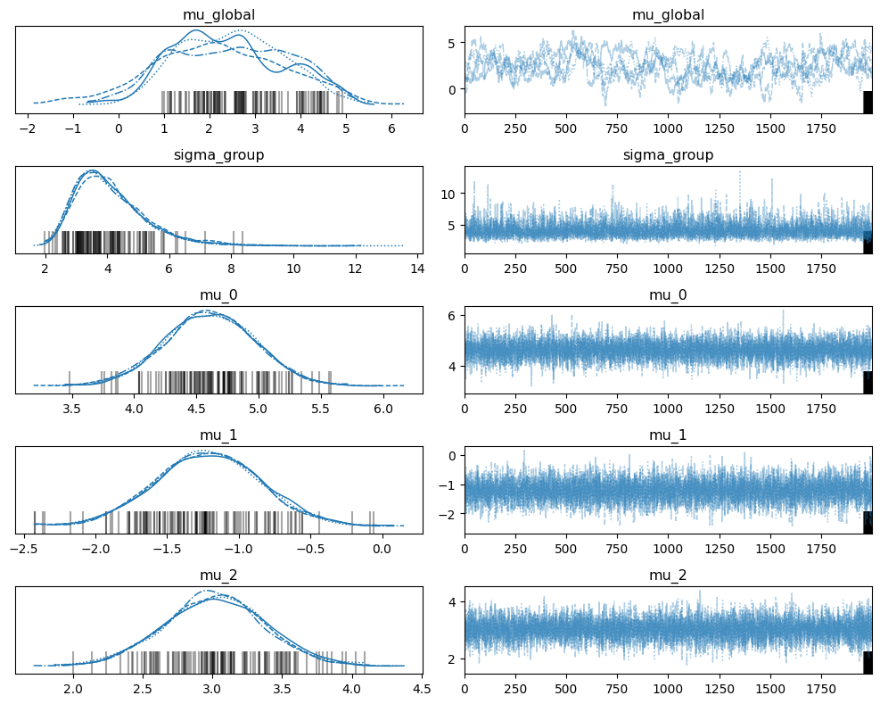
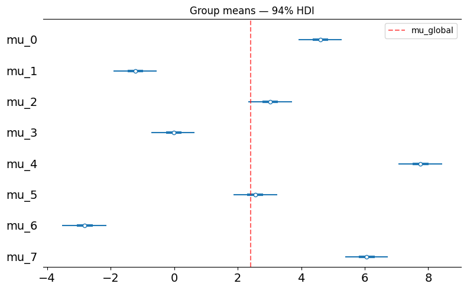
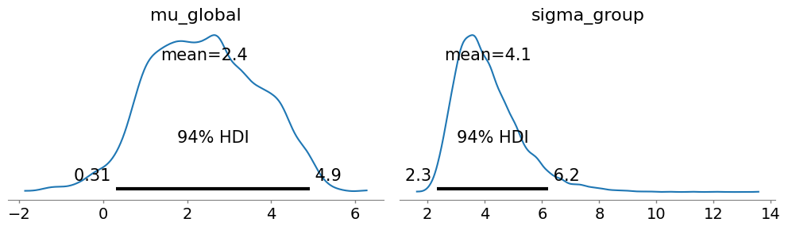

# Hierarchical Models

Partial pooling across groups — the "8 schools" style model. Group-level means share a common
prior whose parameters are themselves inferred from data.

**Model:**
$$\mu_{\text{global}} \sim \text{Normal}(0, 10)$$
$$\sigma_{\text{group}} \sim \text{HalfNormal}(5)$$
$$\mu_j \sim \text{Normal}(\mu_{\text{global}},\ \sigma_{\text{group}})$$
$$y_{ij} \sim \text{Normal}(\mu_j,\ \sigma_{\text{obs}})$$


```python
import numpy as np
import rustmc as rmc
import arviz as az
import matplotlib.pyplot as plt
import matplotlib
matplotlib.rcParams['figure.dpi'] = 100
```

## Simulate Data


```python
np.random.seed(42)
J = 8
sigma_obs = 2.0
N_per_group = 30
mu_true = np.array([5.0, -1.0, 3.0, 0.0, 8.0, 2.0, -3.0, 6.0])

ys   = [np.random.normal(mu_true[j], sigma_obs, N_per_group) for j in range(J)]
data = {f"y_{j}": ys[j] for j in range(J)}

print(f"True mu_global:   {mu_true.mean():.2f}")
print(f"True sigma_group: {mu_true.std():.2f}")
print(f"True mu_j:        {mu_true.tolist()}")
```

    True mu_global:   2.50
    True sigma_group: 3.50
    True mu_j:        [5.0, -1.0, 3.0, 0.0, 8.0, 2.0, -3.0, 6.0]


## Build the Model

Hyperpriors are declared first. `mu_global` and `sigma_group` are `ParamRef` objects —
rustmc resolves them to graph nodes at sample time so gradients flow up to the hyperpriors.


```python
builder = rmc.ModelBuilder(data=data)

mu_global   = builder.normal_prior("mu_global",   mu=0.0, sigma=10.0)
sigma_group = builder.half_normal_prior("sigma_group", sigma=5.0)

mu_j = [
    builder.normal_prior(f"mu_{j}", mu=mu_global, sigma=sigma_group)
    for j in range(J)
]

for j in range(J):
    builder.normal_likelihood(f"obs_{j}", mu_expr=mu_j[j], sigma=sigma_obs, observed_key=f"y_{j}")

model = builder.build()
```

## Sample


```python
fit = rmc.sample(model_spec=model, chains=4, draws=2000, warmup=1000, seed=42)
print(fit.summary())
```

    Sampling done: 12000/12000 | 128 div | elapsed 1s


    4 chains × 2000 draws per chain
    
    Parameter        mean      std     hdi_3%    hdi_97%   ess_bulk   ess_tail    r_hat  mcse_mean
    ────────────────────────────────────────────────────────────────────────────────────────────────
    mu_global      2.4020   1.2983     0.0555     4.7618        122        342   1.0280   0.117312
    sigma_group    4.1013   1.1551     2.5297     6.7398       7998       7998   1.0019   0.012917
    mu_0           4.6099   0.3622     3.9189     5.2830       7998       7998   1.0000   0.004049
    mu_1          -1.2178   0.3632    -1.8997    -0.5282       7998       7998   1.0002   0.004061
    mu_2           3.0163   0.3606     2.3360     3.6990       7998       7998   0.9999   0.004032
    mu_3          -0.0135   0.3666    -0.6839     0.6875       7998       7998   1.0000   0.004099
    mu_4           7.7568   0.3665     7.0757     8.4591       7998       7998   0.9998   0.004098
    mu_5           2.5568   0.3709     1.8681     3.2589       7998       7998   1.0000   0.004147
    mu_6          -2.8198   0.3690    -3.5180    -2.1234       7998       7998   0.9997   0.004126
    mu_7           6.0607   0.3590     5.3950     6.7355       7998       7998   0.9996   0.004014
    ────────────────────────────────────────────────────────────────────────────────────────────────
    Mean accept rate: 0.89  │  Divergences: 128
    ⚠  Some ESS values < 400 — consider increasing draws or tuning.
    ⚠  128 divergent transitions — results may be unreliable.


## ArviZ Diagnostics


```python
idata = fit.to_arviz()
az.summary(idata, round_to=4)
```


<div>
<style scoped>
    .dataframe tbody tr th:only-of-type {
        vertical-align: middle;
    }

    .dataframe tbody tr th {
        vertical-align: top;
    }

    .dataframe thead th {
        text-align: right;
    }
</style>
<table border="1" class="dataframe">
  <thead>
    <tr style="text-align: right;">
      <th></th>
      <th>mean</th>
      <th>sd</th>
      <th>hdi_3%</th>
      <th>hdi_97%</th>
      <th>mcse_mean</th>
      <th>mcse_sd</th>
      <th>ess_bulk</th>
      <th>ess_tail</th>
      <th>r_hat</th>
    </tr>
  </thead>
  <tbody>
    <tr>
      <th>mu_global</th>
      <td>2.4020</td>
      <td>1.2983</td>
      <td>0.3098</td>
      <td>4.9163</td>
      <td>0.1384</td>
      <td>0.0484</td>
      <td>88.5945</td>
      <td>294.2703</td>
      <td>1.0276</td>
    </tr>
    <tr>
      <th>sigma_group</th>
      <td>4.1013</td>
      <td>1.1551</td>
      <td>2.3172</td>
      <td>6.2237</td>
      <td>0.0180</td>
      <td>0.0189</td>
      <td>4021.6192</td>
      <td>5947.9044</td>
      <td>1.0021</td>
    </tr>
    <tr>
      <th>mu_0</th>
      <td>4.6099</td>
      <td>0.3622</td>
      <td>3.9105</td>
      <td>5.2697</td>
      <td>0.0036</td>
      <td>0.0042</td>
      <td>10249.4393</td>
      <td>6273.0873</td>
      <td>1.0001</td>
    </tr>
    <tr>
      <th>mu_1</th>
      <td>-1.2178</td>
      <td>0.3632</td>
      <td>-1.9104</td>
      <td>-0.5462</td>
      <td>0.0039</td>
      <td>0.0040</td>
      <td>8530.2035</td>
      <td>6106.1516</td>
      <td>1.0002</td>
    </tr>
    <tr>
      <th>mu_2</th>
      <td>3.0163</td>
      <td>0.3606</td>
      <td>2.3400</td>
      <td>3.7017</td>
      <td>0.0036</td>
      <td>0.0042</td>
      <td>9987.3182</td>
      <td>6307.4503</td>
      <td>1.0008</td>
    </tr>
    <tr>
      <th>mu_3</th>
      <td>-0.0135</td>
      <td>0.3666</td>
      <td>-0.7159</td>
      <td>0.6450</td>
      <td>0.0041</td>
      <td>0.0042</td>
      <td>7944.7545</td>
      <td>5688.9539</td>
      <td>1.0000</td>
    </tr>
    <tr>
      <th>mu_4</th>
      <td>7.7568</td>
      <td>0.3665</td>
      <td>7.0633</td>
      <td>8.4353</td>
      <td>0.0033</td>
      <td>0.0043</td>
      <td>12036.6233</td>
      <td>6245.7885</td>
      <td>1.0005</td>
    </tr>
    <tr>
      <th>mu_5</th>
      <td>2.5568</td>
      <td>0.3709</td>
      <td>1.8646</td>
      <td>3.2525</td>
      <td>0.0037</td>
      <td>0.0042</td>
      <td>10201.7864</td>
      <td>6408.1608</td>
      <td>1.0006</td>
    </tr>
    <tr>
      <th>mu_6</th>
      <td>-2.8198</td>
      <td>0.3690</td>
      <td>-3.5220</td>
      <td>-2.1290</td>
      <td>0.0037</td>
      <td>0.0042</td>
      <td>9985.6812</td>
      <td>5919.5705</td>
      <td>1.0005</td>
    </tr>
    <tr>
      <th>mu_7</th>
      <td>6.0607</td>
      <td>0.3590</td>
      <td>5.3872</td>
      <td>6.7224</td>
      <td>0.0035</td>
      <td>0.0041</td>
      <td>10310.6316</td>
      <td>6201.2390</td>
      <td>1.0007</td>
    </tr>
  </tbody>
</table>
</div>


## Trace Plot


```python
# Show hyperparameters and a few group means
var_names = ["mu_global", "sigma_group", "mu_0", "mu_1", "mu_2"]
az.plot_trace(idata, var_names=var_names, figsize=(10, 8))
plt.tight_layout()
plt.show()
```


    

    


## Forest Plot — Partial Pooling

Shows all group means with HDI. The partial pooling effect (shrinkage toward the global mean)
is visible when comparing the pooled estimates to raw group sample means.


```python
group_vars = [f"mu_{j}" for j in range(J)]
az.plot_forest(idata, var_names=group_vars, combined=True, figsize=(8, 5))
plt.title("Group means — 94% HDI")
plt.axvline(fit.mean()["mu_global"], color="red", linestyle="--", alpha=0.6, label="mu_global")
plt.legend()
plt.tight_layout()
plt.show()
```


    

    


## Partial Pooling Effect


```python
means = fit.mean()
sample_means = [ys[j].mean() for j in range(J)]

print(f"Global mean estimate: {means['mu_global']:.2f}")
print(f"{'Group':<8} {'Raw':>8} {'Pooled':>10} {'True':>8}")
print("-" * 38)
for j in range(J):
    print(f"mu_{j}     {sample_means[j]:+8.2f} {means[f'mu_{j}']:+10.4f} {mu_true[j]:+8.2f}")
```

    Global mean estimate: 2.40
    Group         Raw     Pooled     True
    --------------------------------------
    mu_0        +4.62    +4.6099    +5.00
    mu_1        -1.24    -1.2178    -1.00
    mu_2        +3.03    +3.0163    +3.00
    mu_3        -0.04    -0.0135    +0.00
    mu_4        +7.81    +7.7568    +8.00
    mu_5        +2.56    +2.5568    +2.00
    mu_6        -2.87    -2.8198    -3.00
    mu_7        +6.10    +6.0607    +6.00


## Hyperparameter Posterior


```python
az.plot_posterior(idata, var_names=["mu_global", "sigma_group"], figsize=(10, 3))
plt.tight_layout()
plt.show()

print(f"mu_global:   true={mu_true.mean():.2f}  estimated={means['mu_global']:.4f} ± {fit.std()['mu_global']:.4f}")
print(f"sigma_group: true={mu_true.std():.2f}  estimated={means['sigma_group']:.4f} ± {fit.std()['sigma_group']:.4f}")
```


    

    


    mu_global:   true=2.50  estimated=2.4020 ± 1.2983
    sigma_group: true=3.50  estimated=4.1013 ± 1.1551

