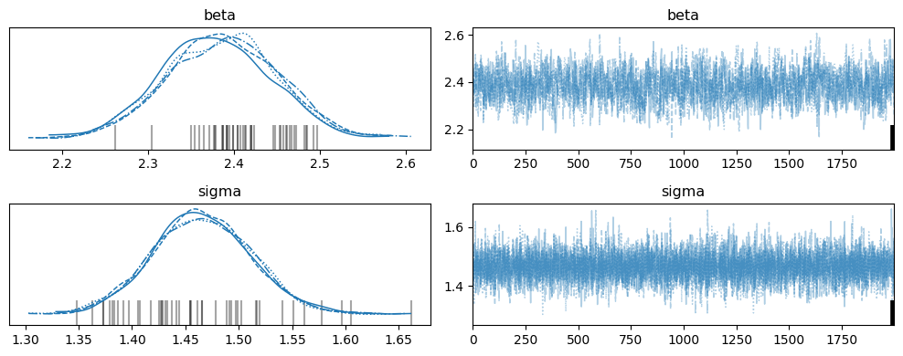
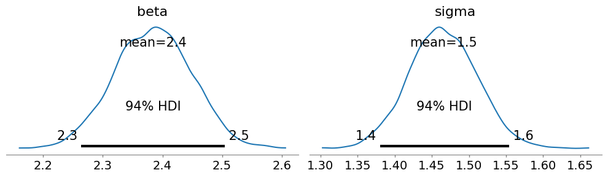
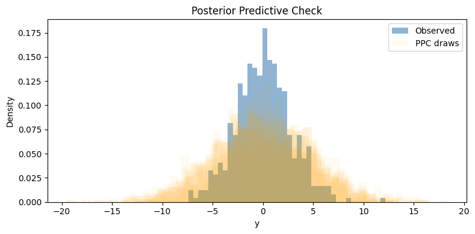

# Linear Regression

Full Bayesian workflow: prior predictive → posterior sampling → ArviZ diagnostics.

**Model:**
$$\beta \sim \text{Normal}(0, 5)$$
$$\sigma \sim \text{HalfNormal}(2)$$
$$y_i \sim \text{Normal}(\beta \cdot x_i,\ \sigma)$$


```python
import numpy as np
import rustmc as rmc
import arviz as az
import matplotlib.pyplot as plt
import matplotlib
matplotlib.rcParams['figure.dpi'] = 100
```

## Generate Data


```python
np.random.seed(42)
N = 500
x = np.random.randn(N)
beta_true  = 2.5
sigma_true = 1.5
y = beta_true * x + np.random.normal(0, sigma_true, N)

print(f"N={N}, beta_true={beta_true}, sigma_true={sigma_true}")
```

    N=500, beta_true=2.5, sigma_true=1.5


## Build and Sample


```python
builder = rmc.ModelBuilder(data={"x": x, "y": y})
beta  = builder.normal_prior("beta",  mu=0.0, sigma=5.0)
sigma = builder.half_normal_prior("sigma", sigma=2.0)
builder.normal_likelihood("obs", mu_expr=beta * "x", sigma=sigma, observed_key="y")
model = builder.build()

fit = rmc.sample(model_spec=model, chains=4, draws=2000, warmup=1000, seed=42)
print(fit.summary())
```

    4 chains × 2000 draws per chain
    
    Parameter        mean      std     hdi_3%    hdi_97%   ess_bulk   ess_tail    r_hat  mcse_mean
    ────────────────────────────────────────────────────────────────────────────────────────────────
    beta           2.3844   0.0647     2.2625     2.5037       1883       3169   1.0084   0.001491
    sigma          1.4654   0.0464     1.3796     1.5534       7998       7998   1.0003   0.000519
    ────────────────────────────────────────────────────────────────────────────────────────────────
    Mean accept rate: 0.89  │  Divergences: 45
    ⚠  45 divergent transitions — results may be unreliable.


    Sampling done: 12000/12000 | 45 div | elapsed 1s


## ArviZ Diagnostics


```python
idata = fit.to_arviz()
az.summary(idata, round_to=4)
```


<div>
<style scoped>
    .dataframe tbody tr th:only-of-type {
        vertical-align: middle;
    }

    .dataframe tbody tr th {
        vertical-align: top;
    }

    .dataframe thead th {
        text-align: right;
    }
</style>
<table border="1" class="dataframe">
  <thead>
    <tr style="text-align: right;">
      <th></th>
      <th>mean</th>
      <th>sd</th>
      <th>hdi_3%</th>
      <th>hdi_97%</th>
      <th>mcse_mean</th>
      <th>mcse_sd</th>
      <th>ess_bulk</th>
      <th>ess_tail</th>
      <th>r_hat</th>
    </tr>
  </thead>
  <tbody>
    <tr>
      <th>beta</th>
      <td>2.3844</td>
      <td>0.0647</td>
      <td>2.2641</td>
      <td>2.5044</td>
      <td>0.0019</td>
      <td>0.0011</td>
      <td>1163.6527</td>
      <td>1704.7791</td>
      <td>1.0084</td>
    </tr>
    <tr>
      <th>sigma</th>
      <td>1.4654</td>
      <td>0.0464</td>
      <td>1.3801</td>
      <td>1.5538</td>
      <td>0.0006</td>
      <td>0.0006</td>
      <td>6353.5804</td>
      <td>4731.3649</td>
      <td>1.0005</td>
    </tr>
  </tbody>
</table>
</div>


## Trace Plot

Checks stationarity and chain mixing. All chains should overlap and show no trends.


```python
az.plot_trace(idata, figsize=(10, 4))
plt.tight_layout()
plt.show()
```


    

    


## Posterior Distributions


```python
az.plot_posterior(idata, figsize=(10, 3))
plt.tight_layout()
plt.show()

means = fit.mean()
stds  = fit.std()
print(f"beta:  true={beta_true}  estimated={means['beta']:.4f} ± {stds['beta']:.4f}")
print(f"sigma: true={sigma_true}  estimated={means['sigma']:.4f} ± {stds['sigma']:.4f}")
```


    

    


    beta:  true=2.5  estimated=2.3844 ± 0.0647
    sigma: true=1.5  estimated=1.4654 ± 0.0464


## Posterior Predictive Check


```python
ppc   = fit.posterior_predictive(n_samples=500, seed=42)
y_rep = ppc["obs"]  # (500, N)

fig, ax = plt.subplots(figsize=(8, 4))
ax.hist(y, bins=40, density=True, alpha=0.6, color='steelblue', label='Observed')
for i in range(0, 500, 50):
    ax.hist(y_rep[i], bins=40, density=True, alpha=0.05, color='orange')
ax.hist(y_rep[0], bins=40, density=True, alpha=0.05, color='orange', label='PPC draws')
ax.set_xlabel('y')
ax.set_ylabel('Density')
ax.set_title('Posterior Predictive Check')
ax.legend()
plt.tight_layout()
plt.show()

ppc_p = (y_rep.std(axis=1) > y.std()).mean()
print(f"PPC p-value (std): {ppc_p:.3f}  (0.5 = perfect calibration)")
```


    

    


    PPC p-value (std): 1.000  (0.5 = perfect calibration)

